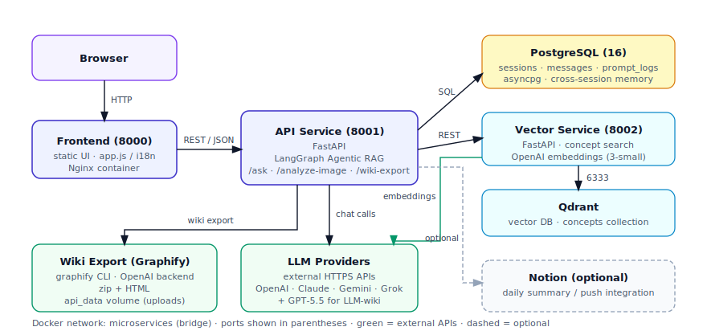
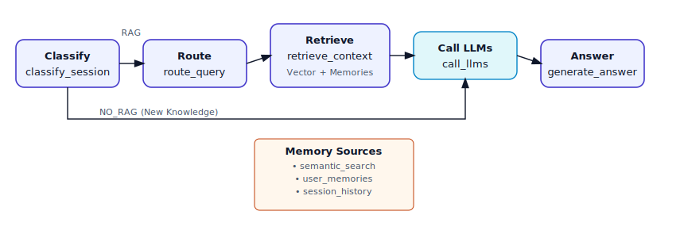
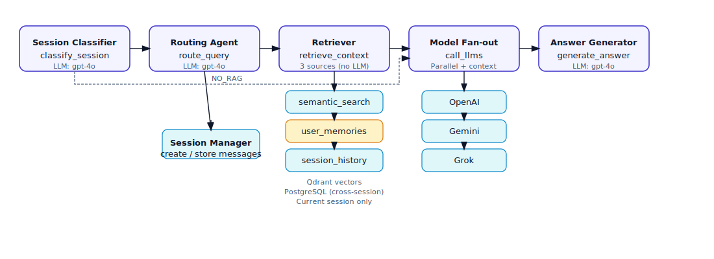

# SecondBrain AgenticRAG

A modernized Second Brain system that keeps conversational memory, routes queries through an agentic workflow, and stores searchable knowledge across text and images.

## Highlights

- **Agentic RAG** — LangGraph-powered workflow that routes, retrieves, and refines
- **Cross-Session Memory** — Remembers past conversations across all sessions via PostgreSQL
- **Triple-Source Retrieval** — Combines vector search, user memories, and session history
- **Multi-LLM Parallel Calls** — Queries OpenAI, Gemini, and Grok simultaneously with context
- **Smart Summarization** — Gemini-primary with automatic OpenAI fallback on quota limits
- **Notion Push** — Export conversation summaries directly to your Notion database

---

## Architecture



### Services Overview

| Service | Port | Description |
|---------|------|-------------|
| **Frontend** | 8000 | Web UI for chat interface |
| **API** | 8001 | FastAPI + LangGraph agentic pipeline |
| **Vector** | 8002 | Embedding generation and semantic search |
| **Qdrant** | 6333 | Vector database for knowledge storage |
| **PostgreSQL** | 5432 | Sessions, messages, and cross-session memories |

---

## Agentic Workflow



The agentic RAG pipeline follows these stages:

1. **Route** (`route_query`) — LLM decides whether retrieval is needed
2. **Retrieve** (`retrieve_context`) — Gathers context from 3 sources (no LLM)
3. **Call LLMs** (`call_llms`) — Parallel calls to OpenAI/Gemini/Grok with injected context
4. **Answer** (`generate_answer`) — Synthesizes final response from all LLM outputs

---

## Agent Flow



### Memory Sources

| Source | Storage | Scope | Purpose |
|--------|---------|-------|---------|
| `semantic_search` | Qdrant | Global | Vector similarity search on stored knowledge |
| `user_memories` | PostgreSQL | Cross-session | Retrieve past Q&A from `prompt_logs` table |
| `session_history` | PostgreSQL | Current session | Recent messages for immediate context |

### LLM Providers

All LLMs receive the **full retrieved context** injected into their prompts:

- **OpenAI** (gpt-4o) — Primary reasoning model
- **Gemini** — Fast responses, used for summarization
- **Grok** — Alternative perspective

---

## Quick Start

### Prerequisites

- Docker & Docker Compose
- API keys for: OpenAI, Gemini (optional), Grok (optional)
- Notion token (optional, for Notion push feature)

### Setup

1. Clone the repository:
   ```bash
   git clone https://github.com/yourusername/SecondBrian_AgenticRAG.git
   cd SecondBrian_AgenticRAG
   ```

2. Create `.env` file with your credentials:
   ```bash
   # Required
   OPENAI_API_KEY=your-openai-key
   
   # Optional LLMs
   GEMINI_API_KEY=your-gemini-key
   GROK_API_KEY=your-grok-key
   
   # Optional Notion
   NOTION_TOKEN=your-notion-token
   NOTION_DB_ID=your-notion-database-id
   
   # Database (defaults provided)
   POSTGRES_USER=alvin
   POSTGRES_PASSWORD=securepass123
   POSTGRES_DB=secondbrain
   ```

3. Start all services:
   ```bash
   docker compose up -d --build
   ```

4. Access the UI at [http://localhost:8000](http://localhost:8000)

### Reset & Clean Start

```bash
./reset_and_run.sh
```

---

## API Endpoints

### Chat

| Method | Endpoint | Description |
|--------|----------|-------------|
| `POST` | `/sessions` | Create new conversation session |
| `GET` | `/sessions` | List user sessions |
| `POST` | `/sessions/{id}/messages` | Send message (triggers agentic RAG) |
| `GET` | `/sessions/{id}/messages` | Get session message history |
| `DELETE` | `/sessions/{id}` | Delete a session |

### Vector Operations

| Method | Endpoint | Description |
|--------|----------|-------------|
| `POST` | `/vector/concepts/upsert` | Add/update knowledge entries |
| `POST` | `/vector/concepts/search` | Semantic search |
| `GET` | `/vector/knowledge-graph` | Query knowledge graph |

### Tools

| Method | Endpoint | Description |
|--------|----------|-------------|
| `POST` | `/summarize` | Generate smart summary |
| `POST` | `/notion/push` | Push to Notion database |
| `POST` | `/combo` | Summarize + Notion push |

---

## Tools Reference

| Tool | Description |
|------|-------------|
| `semantic_search_tool` | Queries Qdrant for semantically similar content |
| `session_history_tool` | Retrieves messages from current session |
| `user_memories_tool` | Fetches past Q&A from PostgreSQL across all sessions |
| `knowledge_graph_tool` | Explores related concepts via graph traversal |

---

## Environment Variables

| Variable | Default | Description |
|----------|---------|-------------|
| `OPENAI_API_KEY` | — | OpenAI API key (required) |
| `GEMINI_API_KEY` | — | Google Gemini API key |
| `GROK_API_KEY` | — | xAI Grok API key |
| `OPENAI_MODEL` | `gpt-4o` | OpenAI model for reasoning |
| `GEMINI_MODEL` | `gemini-2.0-flash-exp` | Gemini model |
| `GROK_MODEL` | `grok-beta` | Grok model |
| `NOTION_TOKEN` | — | Notion integration token |
| `NOTION_DB_ID` | — | Target Notion database ID |
| `AGENTIC_SIM_THRESHOLD` | `0.6` | Minimum similarity score for vector search |

---

## Project Structure

```
SecondBrian_AgenticRAG/
├── docker-compose.yml           # Service orchestration
├── reset_and_run.sh             # Clean start script
├── docs/
│   ├── architecture.svg         # System architecture diagram
│   ├── workflow.svg             # Agentic RAG workflow
│   ├── agent-flow.svg           # Detailed agent flow
│   └── agentic-graph.svg        # LangGraph state diagram
└── services/
    ├── init.sql                 # Database schema
    ├── api-service/             # FastAPI + LangGraph
    │   ├── main.py              # API endpoints
    │   ├── agentic/
    │   │   ├── graph.py         # LangGraph workflow
    │   │   ├── state.py         # Conversation state
    │   │   ├── tools.py         # RAG tools
    │   │   └── prompts.py       # System prompts
    │   ├── db/                  # Database operations
    │   ├── tools/               # Summarizer, Notion push
    │   └── auth/                # Authentication middleware
    ├── frontend-service/        # Web UI (Gradio + static)
    └── vector-service/          # Embeddings + Qdrant proxy
```

---

## Development

### Rebuild a single service
```bash
docker compose up -d --build api
```

### View logs
```bash
docker compose logs -f api
```

### Access PostgreSQL
```bash
docker compose exec db psql -U alvin -d secondbrain
```

